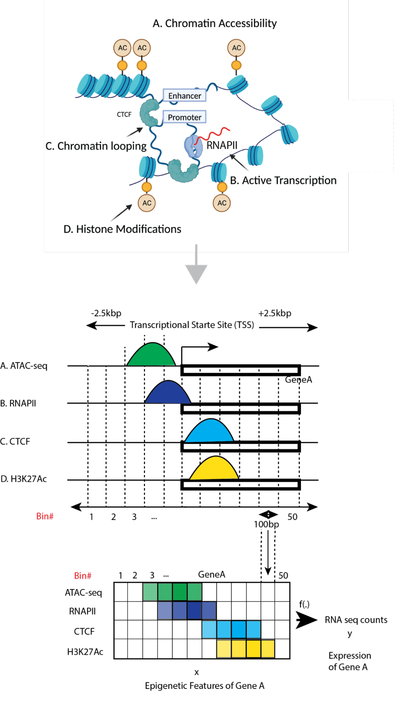
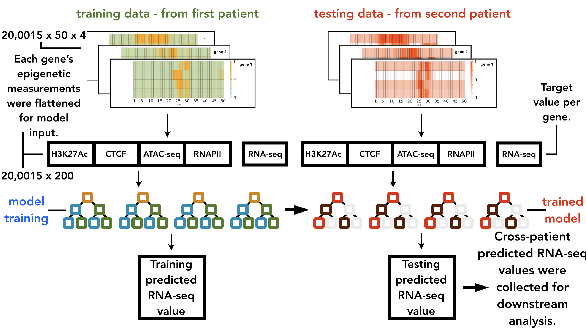
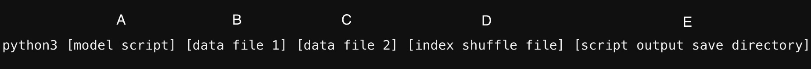

## Machine learning on multiple epigenetic features reveals H3K27Ac as a driver of gene expression prediction across patients with glioblastoma.

## Abstract:
Cancer cells show remarkable plasticity and can switch lineages in response to the tumor microenvironment. Cellular plasticity drives invasiveness and metastasis and helps cancer cells to evade therapy by developing resistance to radiation and cytotoxic chemotherapy. Increased understanding of cell fate determination through epigenetic reprogramming is critical to discover how cancer cells achieve transcriptomic and phenotypic plasticity. 

Glioblastoma is a perfect example of cancer evolution where cells retain an inherent level of plasticity through activation or maintenance of progenitor developmental programs. However, the principles governing epigenetic drivers of cellular plasticity in glioblastoma remain poorly understood. Here, using machine learning (ML) we employ cross-patient prediction of transcript expression using a combination of epigenetic features (ATAC-seq, CTCF ChIP-seq, RNAPII ChIP-seq, H3K27Ac ChIP-seq, and RNA-seq) of glioblastoma stem cells (GSCs). We investigate different ML and deep learning (DL) models for this task and build our final pipeline using XGBoost. The model trained on one patient generalizes to another one suggesting that the epigenetic signals governing gene transcription are consistent across patients even if GSCs can be very different. We demonstrate that H3K27Ac is the epigenetic feature providing the most significant contribution to cross-patient prediction of gene expression. In addition, using H3K27Ac signals from patients-derived GSCs, we can predict gene expression of human neural crest stem cells suggesting a shared developmental epigenetic trajectory between subpopulations of these malignant and benign stem cells.       

Our cross-patient ML/DL models determine weighted patterns of influence of epigenetic marks on gene expression across patients with glioblastoma and between GSCs and neural crest stem cells. We propose that broader application of this analysis could reshape our view of glioblastoma tumor evolution and inform the design of new epigenetic targeting therapies. 





## Datasets:
Two patient epigenetic marker files are provided in the [data](data) folder. Specifically, the latest versions of these GSC measurements are located in the [latest_versions_of_all_raw](data/latest_versions_of_all_raw) subfolder. Additionally, the [ind_shuffle.npy](data/ind_shuffle.npy) file is provided. This file was used to create consistent dataset splits for train, validation, and test sets.

## Setup process:

Clone this repository to the local filesystem using the link provided by the "Code" dropdown button above. For example:

```
git clone https://github.com/rsinghlab/ML_epigenetic_features_glioblastoma.git
```

Change the current working directory to the folder created by the clone process:

```
cd ./ML_epigenetic_features_glioblastoma
```

We recommend that a virtual environment be created to allow for the installation of the required packages and libraries in a without potential conflict with other packages already installed on the system. In the example here the virtual environment is given the same name as the project folder.

```
python3 -m venv ML_epigenetic_features_glioblastoma
```

Activate the new python environment.

```
source ./ML_epigenetic_features_glioblastoma/bin/activate
```

you can now install packages into the new environment using the included [requirements.txt](requirements.txt) file.

```
pip3 install -r requirements.txt
```

## How run the model scripts:

### Cross-patient prediction models:

The project's cross-patient prediction models are avaliable in the following locations:

XGBoost (XGBR) [code/models/xgboost/xgboost_cross_patient_pred_regression_gsc_stem_standard_log2.py](code/models/xgboost/xgboost_cross_patient_pred_regression_gsc_stem_standard_log2.py)

"Branched" Multi-layered Perceptron ("Branched" MLP)
[code/models/mlp/mlp_cross_patient_regression_gsc_stem_sequence_standard_log2.py](code/models/mlp/mlp_cross_patient_regression_gsc_stem_sequence_standard_log2.py)

Multi-layered Perceptron (MLP)
[code/models/mlp/mlp_cross_patient_regression_gsc_stem_standard_log2.py](code/models/mlp/mlp_cross_patient_regression_gsc_stem_standard_log2.py)

Convolutional Neural Network (CNN) 
[code/models/cnn/cnn_cross_patient_pred_regression_gsc_stem_standard_log2.py](code/models/cnn/cnn_cross_patient_pred_regression_gsc_stem_standard_log2.py)

Recurrent Neural Network (RNN)
[code/models/rnn/rnn_models.py](code/models/rnn/rnn_models.py)

Gradient Boosting Regression (GBR)
[code/models/gbr/gbr_cross_patient_pred_regression_gsc_stem_standard_log2.py](code/models/gbr/gbr_cross_patient_pred_regression_gsc_stem_standard_log2.py)

Support Vector Machine (SVR)
[code/models/svm/svm_cross_patient_pred_regression_gsc_stem_standard_log2.py](code/models/svm/svm_cross_patient_pred_regression_gsc_stem_standard_log2.py)

Multiple Linear Regression (MLR)
[code/models/mlr/mlr_cross_patient_pred_regression_gsc_stem_standard_log2.py](code/models/mlr/mlr_cross_patient_pred_regression_gsc_stem_standard_log2.py)

### Script arguments:



A) The script's path and filename.

B) The first data file's path and filename. This script creates the model's training and validation (or training only) sets from this file. 


NOTE: The creation of a validation set is controlled by the ```validation = True``` or ```False``` statement in the script's ```main()``` function. The proportions given to each set  
